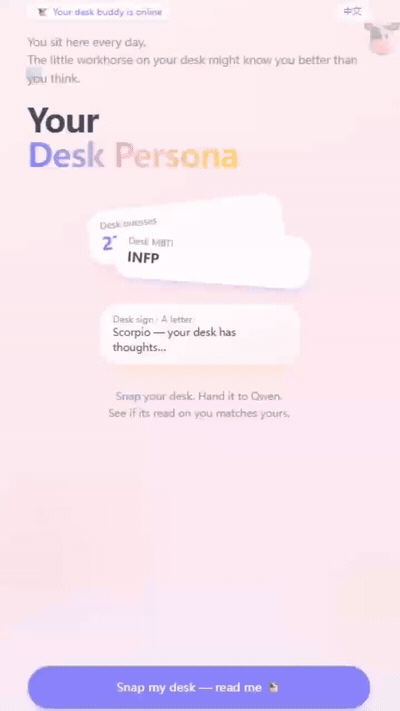

# Desk Speaks · 你的工位人格

Upload a photo of your desk and get a playful AI persona report — age guess, desk MBTI, desk zodiac, a letter from your desk, and a shareable cert card.

**Live:** [English](https://desk.zeabur.app/en) · [中文](https://desk.zeabur.app/zh)

## Demo



Try it live: [desk.zeabur.app/en](https://desk.zeabur.app/en) · [中文](https://desk.zeabur.app/zh)

---

## What it does

1. **Upload** — snap or pick a photo of your everyday desk (no staging required)
2. **Analyze** — [Qwen-VL](https://help.aliyun.com/zh/model-studio/developer-reference/qwen-vl/) reads visible items and infers a “desk persona”
3. **Report** — swipe through five cards: first look → MBTI → zodiac → letter → share cert
4. **Share** — save a portrait-style cert image with QR code

Chinese version also includes curated desk essentials with JD affiliate links (`/zh/recommend`). English version skips product recommendations for now.

---

## Tech stack

| Layer | Choice |
|-------|--------|
| Framework | Next.js 15 (App Router), React 19 |
| Language | TypeScript |
| Styling | Tailwind CSS |
| i18n | [next-intl](https://next-intl.dev) — `/en`, `/zh` |
| AI | Alibaba DashScope / Qwen-VL (`qwen-vl-plus`) |
| Analytics (optional) | Supabase |
| Deploy | [Zeabur](https://zeabur.com) |

---

## Project structure

```
app/
  [locale]/          # Pages: home, upload, analyzing, report, recommend
  api/analyze/       # Vision analysis API
  api/stats/         # Optional trait stats
components/          # UI + report swiper + share image
lib/
  prompts/           # zh/en system prompts + mock reports
  office-picks/      # Product catalog (zh only)
messages/            # zh.json, en.json UI copy
i18n/                # Routing & navigation helpers
```

---

## Local development

**Requirements:** Node 20.x

```bash
git clone https://github.com/dww1999zj-cn/desk-speaks.git
cd desk-speaks
npm install
cp .env.example .env.local
```

Edit `.env.local`:

```bash
DASHSCOPE_API_KEY=sk-your-key        # Required for real AI (omit + USE_MOCK_DATA=true for mock)
QWEN_VL_MODEL=qwen-vl-plus
USE_MOCK_DATA=true                   # Set false when you have an API key
NEXT_PUBLIC_SITE_URL=http://localhost:3000
```

```bash
npm run dev
# http://localhost:3000/en  or  /zh
```

Build for production:

```bash
npm run build
npm start
```

---

## Environment variables

| Variable | Description |
|----------|-------------|
| `DASHSCOPE_API_KEY` | Alibaba Bailian / Qwen API key |
| `QWEN_VL_MODEL` | Vision model (default `qwen-vl-plus`) |
| `USE_MOCK_DATA` | `true` → return mock report without API |
| `NEXT_PUBLIC_SITE_URL` | Base URL for share-card QR codes |
| `NEXT_PUBLIC_SUPABASE_URL` | Optional — stats storage |
| `SUPABASE_SERVICE_ROLE_KEY` | Optional — server-side Supabase |

Run `supabase/schema.sql` in Supabase SQL Editor if you enable stats.

---

## Routes

| Path | Description |
|------|-------------|
| `/` | Redirects to `/zh` |
| `/en`, `/zh` | Home |
| `/[locale]/upload` | Photo upload |
| `/[locale]/analyzing` | AI analysis |
| `/[locale]/report` | Persona report |
| `/[locale]/recommend` | Desk picks (zh only) |

---

## License

Private project. All rights reserved.

---

**© 闲里偷忙 · WeChat: alex_198888**
