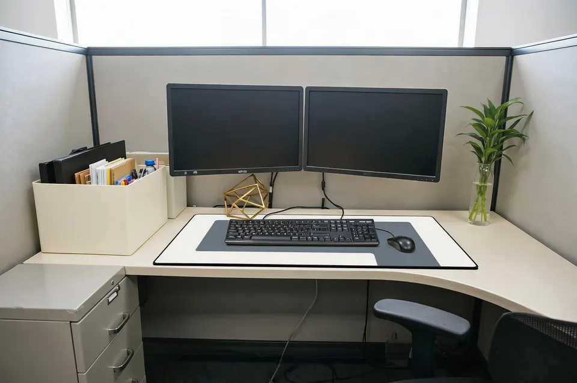

# 工位设计师 · Desk Designer

Upload a desk photo → get an AI renovation preview (before / after) plus a short organize plan.  
上传一张工位照，生成改造前后对比图与收纳方案。

**Live:** [中文](https://desk.zeabur.app/zh) · [English](https://desk.zeabur.app/en)

<p align="center">
  
</p>

---

## What it does

### Main · Desk renovation（工位改造）

1. **Upload** — everyday desk photo; pick a style (INS / Japanese / Cyberpunk)
2. **Analyze** — [Qwen-VL](https://help.aliyun.com/zh/model-studio/) detects the desk, clutter, and a renovation plan
3. **Generate** — [通义万相](https://help.aliyun.com/zh/model-studio/developer-reference/wan-image-edit-api-reference/) produces an after image (same desk geometry; storage & decor only)
4. **Report** — before/after slider, step plan, share poster with QR

### Secondary · Desk persona（工位人格）

Optional playful report from the desk’s POV (MBTI / zodiac / letter). Entry: homepage → “工位人格” / persona link → `/persona/upload`.

Chinese build can also surface desk picks with JD links (`/zh/recommend`).

---

## Tech stack

| Layer | Choice |
|-------|--------|
| App | Next.js 15 (App Router), React 19, TypeScript |
| UI | Tailwind CSS |
| i18n | [next-intl](https://next-intl.dev) — `/zh`, `/en` |
| Vision / plan | DashScope · Qwen-VL (`qwen-vl-plus`) |
| After image | DashScope · Wan (`wan2.6-image`, fallback `wanx2.1-imageedit`) |
| Stats (optional) | Supabase |
| Deploy | [Zeabur](https://zeabur.com) |

Model details: [`docs/MODEL_CONFIG.md`](docs/MODEL_CONFIG.md)

---

## Project structure

```
app/
  [locale]/                 # Home, upload, analyzing, report, recommend
    persona/                 # Secondary persona flow
  api/analyze/               # Renovation: Qwen plan + Wan image
  api/persona/analyze/       # Persona report
  api/stats/                 # Generation counter
components/
  marketing/                 # Homepage before/after showcase
  report/                    # Slider, share image, plan UI
  upload/                    # Photo + style picker
lib/
  renovation/                # Prompts, Wan client, parse, accents/styles
  prompts/                   # Persona prompts + mocks
  marketing-assets.ts        # Showcase image paths (WebP display)
messages/                    # zh.json / en.json
scripts/
  compose-promo-poster.mjs   # zh/en promo posters + QR
  optimize-marketing-display.mjs
  generate-marketing-afters.mjs
```

---

## Local development

**Node 20.x**

```bash
git clone https://github.com/dww1999zj-cn/desk-speaks.git
cd desk-speaks
npm install
cp .env.example .env.local
```

Minimal `.env.local` for mock UI:

```bash
USE_MOCK_DATA=true
NEXT_PUBLIC_SITE_URL=http://localhost:3000
```

Real renovation (Qwen + Wan):

```bash
DASHSCOPE_API_KEY=sk-your-key
QWEN_VL_MODEL=qwen-vl-plus
WANX_EDIT_MODEL=wan2.6-image
WANX_FALLBACK_EDIT_MODEL=wanx2.1-imageedit
WANX_TWO_PASS=false
WANX_IMAGE_SIZE=2K
USE_MOCK_DATA=false
NEXT_PUBLIC_SITE_URL=http://localhost:3000
```

```bash
npm run dev
# http://localhost:3000/zh  or  /en
```

```bash
npm run build && npm start
```

---

## Environment variables

| Variable | Description |
|----------|-------------|
| `DASHSCOPE_API_KEY` | Alibaba Bailian API key |
| `QWEN_VL_MODEL` | Vision model (default `qwen-vl-plus`) |
| `WANX_EDIT_MODEL` | After-image model (default `wan2.6-image`) |
| `WANX_FALLBACK_EDIT_MODEL` | Quota / failure fallback (`wanx2.1-imageedit` or `none`) |
| `WANX_TWO_PASS` | `true` = organize then accent (2× Wan calls); default `false` |
| `WANX_IMAGE_SIZE` | Wan 2.6/2.7 size (default `2K`) |
| `USE_MOCK_DATA` | `true` → mock plan/report, skip live AI |
| `SKIP_WANX_IMAGE` | Skip after-image; keep text plan only |
| `NEXT_PUBLIC_SITE_URL` | Share / promo QR base URL |
| `NEXT_PUBLIC_SUPABASE_URL` | Optional stats |
| `SUPABASE_SERVICE_ROLE_KEY` | Optional stats |

See `.env.example` and [`docs/MODEL_CONFIG.md`](docs/MODEL_CONFIG.md).

---

## Routes

| Path | Description |
|------|-------------|
| `/` | → `/zh` |
| `/[locale]` | Home + marketing before/after |
| `/[locale]/upload` | Renovation upload + style |
| `/[locale]/analyzing` | Plan + image generation |
| `/[locale]/report` | Before/after + plan + share |
| `/[locale]/persona/upload` | Persona upload |
| `/[locale]/persona/analyzing` | Persona analysis |
| `/[locale]/persona/report` | Persona cards |
| `/[locale]/recommend` | Desk picks (zh) |

---

## Marketing assets

Homepage slider uses compressed WebP (`*-display.webp`), not full PNG masters:

```bash
node scripts/optimize-marketing-display.mjs
```

Promo posters (zh / en QR):

```bash
node scripts/compose-promo-poster.mjs --locale all
# → public/marketing/promo-half-half-qr.png
# → public/marketing/promo-half-half-qr-en.png
```

---

## Deploy (Zeabur)

1. Connect the GitHub repo; build on `main`
2. Set the same env vars as production (at least `DASHSCOPE_API_KEY`, `USE_MOCK_DATA=false`, Wan model vars, `NEXT_PUBLIC_SITE_URL`)
3. Optional: run `supabase/schema.sql` / `add_generations.sql` for the counter

---

## License

Private project. All rights reserved.

**© 闲里偷忙 · WeChat: alex_198888**
